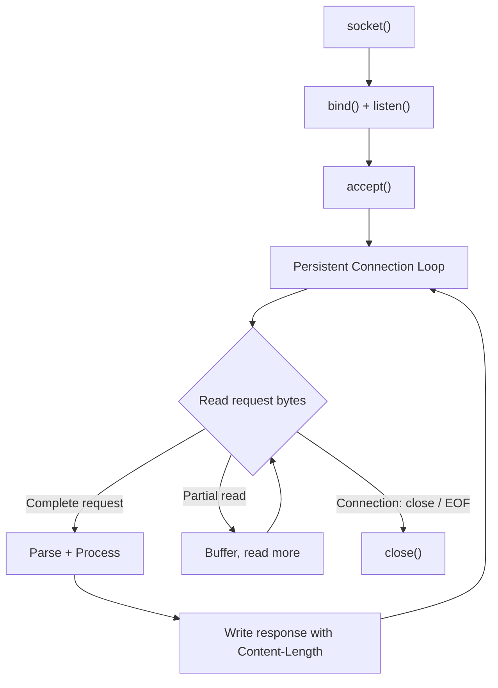

# Product Requirements Document
## NetworkArchitecture101 — Course Assignments

> **Author:** Auto-generated from repository analysis  
> **Date:** 2026-09-24  
> **Status:** Draft — awaiting feedback  
> **Repository:** [NetworkArchitecture101](file:///c:/Users/somva/OneDrive/bookmarked/NetworkArchitecture101)

---

## 1. Context — What the Lessons Covered

The repository contains five sessions' worth of hands-on networking education, building from raw sockets up to HTTP/3. Every concept below was taught with runnable code, not slides.

### Lesson 1 — Sockets, Signals, Wire Encoding
| Topic | Code | Key Takeaway |
|---|---|---|
| Single-shot echo server | [`01_echo_server.c`](file:///c:/Users/somva/OneDrive/bookmarked/NetworkArchitecture101/lesson1/01_echo_server.c) | `socket → bind → listen → accept → read → write → close` — the irreducible TCP server |
| Persistent connections | [`02_echo_server_persistent.c`](file:///c:/Users/somva/OneDrive/bookmarked/NetworkArchitecture101/lesson1/02_echo_server_persistent.c) | Inner `while(read > 0)` loop keeps the connection alive; client decides when to leave |
| Concurrency via fork | [`03_echo_server_fork.c`](file:///c:/Users/somva/OneDrive/bookmarked/NetworkArchitecture101/lesson1/03_echo_server_fork.c) | One OS process per client; simple but expensive |
| SIGPIPE | [`04_sigpipe_server.c`](file:///c:/Users/somva/OneDrive/bookmarked/NetworkArchitecture101/lesson1/04_sigpipe_server.c), [`05–07`](file:///c:/Users/somva/OneDrive/bookmarked/NetworkArchitecture101/lesson1) | Writing to a reset socket kills the process; `SO_LINGER{1,0}` forces RST; `getaddrinfo()` is the modern DNS API |
| BCD, Base64, TLV, ASN.1/DER | [`08_bcd.c`](file:///c:/Users/somva/OneDrive/bookmarked/NetworkArchitecture101/lesson1/08_bcd.c) – [`11_asn1_der.c`](file:///c:/Users/somva/OneDrive/bookmarked/NetworkArchitecture101/lesson1/11_asn1_der.c) | Four wire-encoding patterns: nibble-packing, 6-bit alphabet, type-length-value, and self-describing nested TLV (DER) |

### Lesson 2 — OSI, SS7, Hands-on Protocols
Covered via [PDF](file:///c:/Users/somva/OneDrive/bookmarked/NetworkArchitecture101/lesson1/Lesson_2___CN_Scaler___OSI___SS7___Hands_on_Protocols.pdf). Theoretical grounding in layered architecture and the TLS handshake (referenced in Lesson 5 as prior knowledge).

### Lesson 3 — I/O Multiplexing with `select()`
| Topic | Code | Key Takeaway |
|---|---|---|
| `select()` event loop | [`01_echo_server_select.c`](file:///c:/Users/somva/OneDrive/bookmarked/NetworkArchitecture101/lesson3/01_echo_server_select.c) | Single-process concurrency; one `fd_set` watches all clients. Hard wall at `FD_SETSIZE = 1024` |
| fork vs. select | README | Same result, opposite trade-offs: per-process isolation vs. per-fd efficiency |

### Lesson 4 — nginx, From Scratch
Seven programs in [nginx-from-scratch](file:///c:/Users/somva/OneDrive/bookmarked/NetworkArchitecture101/lesson4/nginx-from-scratch) that reconstruct the 1994→2004 web server evolution:

| Step | Pattern | Key Insight |
|---|---|---|
| 01-fork | `fork()` per client | Apache 1.3's model; grows a process per connection |
| 02-thread | `pthread` per client | 8 MiB default stack × 10K threads = 80 GB of address space |
| 03-select | `select()` loop | The 1024-fd wall; stack-smashing if you exceed it |
| 04-epoll | `epoll()` loop | **O(active) not O(watched)** — the reason nginx exists. Stale-event problem and the generation-flag solution |
| 05-sendfile | `read` vs `mmap` vs `sendfile` | 2048 syscalls → 1; the win is headroom under concurrency, not single-transfer speed |
| 06-fastcgi | FastCGI wire protocol | Fixed 8-byte record header; empty record = end-of-stream |
| 07-nginx | Real `nginx.conf` | Location precedence, weighted round-robin, `try_files`, reverse-proxy caching |

Plus a [596-line guided tour of nginx source](file:///c:/Users/somva/OneDrive/bookmarked/NetworkArchitecture101/lesson4/nginx-from-scratch/NGINX-TOUR.md) covering: process model, event loop, accept mutex, epoll stale events, the HTTP parser as a resumable DFA, phases & location tree, sendfile decision, cache LRU, smooth weighted round-robin, and the FastCGI record state machine.

### Lesson 5 — HTTP 1.0 → 1.1 → 2 → 3
[http-evolution](file:///c:/Users/somva/OneDrive/bookmarked/NetworkArchitecture101/lesson5/http-evolution) — every claim on a slide is a runnable program:

| Era | Code | Key Lessons |
|---|---|---|
| HTTP/1.0 | [`server10.py`](file:///c:/Users/somva/OneDrive/bookmarked/NetworkArchitecture101/lesson5/http-evolution/01-http10/server10.py) | One response per TCP connection, always. No `Host` header. Server closes → client knows response ended |
| HTTP/1.1 | [`server11.py`](file:///c:/Users/somva/OneDrive/bookmarked/NetworkArchitecture101/lesson5/http-evolution/02-http11/server11.py) | Persistent connections (default), `Connection: close` to opt out, `Host` → virtual hosts, chunked encoding, Range/206, ETag/304, gzip/Vary, 100 Continue, pipelining |
| HTTP/1.1 costs | [`03-limits/`](file:///c:/Users/somva/OneDrive/bookmarked/NetworkArchitecture101/lesson5/http-evolution/03-limits) | **Nagle + delayed ACK = 40 ms/asset bug**, head-of-line blocking kills pipelining, 97.5% of headers are byte-for-byte repeats, framing ambiguity → request smuggling |
| HTTP/2 | [`hpack_mini.py`](file:///c:/Users/somva/OneDrive/bookmarked/NetworkArchitecture101/lesson5/http-evolution/04-http2/hpack_mini.py), [`h2_client.py`](file:///c:/Users/somva/OneDrive/bookmarked/NetworkArchitecture101/lesson5/http-evolution/04-http2/h2_client.py), [`h2_server.py`](file:///c:/Users/somva/OneDrive/bookmarked/NetworkArchitecture101/lesson5/http-evolution/04-http2/h2_server.py) | Binary framing with 9-byte frame header, HPACK header compression (55% → 97% smaller), stream multiplexing via 31-bit stream ID, but still TCP head-of-line blocking |
| HTTP/3 + QUIC | [`05-http3/`](file:///c:/Users/somva/OneDrive/bookmarked/NetworkArchitecture101/lesson5/http-evolution/05-http3) | Per-stream loss isolation, 3 RTT → 2 RTT → 1 RTT (0-RTT) handshake, UDP-based transport |

---

## 2. The Assignments

Two distinct deliverables emerge from the assignment images:

---

### Assignment A — "Build a Calculator That Stays on the Line"
**Due before:** Session 7  
**Course section:** Early HTTP/1.1

#### 2A.1 — Problem Statement

Build a **raw-socket HTTP/1.1 calculator server** (no frameworks, just a socket) that:
- Accepts arithmetic requests as URL paths
- Returns the result as HTTP responses
- **Keeps the TCP connection open** across multiple requests (persistent HTTP/1.1)

#### 2A.2 — Functional Requirements

| ID | Requirement | Expected Behaviour |
|---|---|---|
| **F-01** | `GET /add?a=2&b=3` | → `200  5` |
| **F-02** | `GET /sub?a=10&b=4` | → `200  6` |
| **F-03** | `GET /mul?a=6&b=7` | → `200  42` |
| **F-04** | `GET /div?a=9&b=3` | → `200  3` |
| **F-05** | `GET /div?a=1&b=0` | → `400` (division by zero) |
| **F-06** | `GET /add?a=5&b=` | → `400` (missing or empty parameter) |
| **F-07** | `GET /pow?a=2&b=8` | → `404` (unknown operation) |
| **F-08** | `POST /add` | → `405` (method not allowed; only GET) |
| **F-09** | `GET /add` (no `Host` header) | → `400` (HTTP/1.1 mandates `Host`) |

#### 2A.3 — Connection Semantics (The Hard Part)

> *"The part that is actually hard. Keeping the connection open forces a question HTTP/1.0 never asked you: where does this request end and the next one begin?"*

| ID | Requirement | Detail |
|---|---|---|
| **C-01** | Persistent connection by default | One TCP handshake serves **all** requests. The socket must stay open after each response. |
| **C-02** | Correct message framing | Every response **must** include an accurate `Content-Length` header. You must consume exactly `Content-Length` bytes from requests — not one more, not one less — because byte N+1 belongs to the next request. |
| **C-03** | Request boundary parsing | Buffer management must correctly handle: (a) a read that contains the tail of one request + the head of the next, (b) a request that arrives across multiple `read()` calls. |
| **C-04** | Idle timeout (stretch) | Honour `Connection: close` from the client; optionally implement an idle timeout to avoid leaking sockets. |

#### 2A.4 — Grading Criteria (from the image)

The marker's test uses **one socket, every request**:

```python
s = socket.create_connection(("localhost", 8080))
# Send all requests on s, verify all responses come back correctly
# Assert: socket still open = True
# Assert: 1 TCP handshake, 6 responses
```

If the socket dies between requests, **it fails**, regardless of arithmetic correctness.

#### 2A.5 — Stretch Goals (All Optional)

| ID | Feature | Notes |
|---|---|---|
| **S-01** | Honour `Connection: close` | If the client sends `Connection: close`, close gracefully after that response |
| **S-02** | Idle timeout | Close the connection if no data arrives within N seconds |
| **S-03** | Chunked encoding defense | Handle (or gracefully reject) `Transfer-Encoding: chunked` on incoming requests |
| **S-04** | Pipelining | Accept all six requests at once and answer in order |

#### 2A.6 — Constraints

| Constraint | Value |
|---|---|
| Language | Any |
| Frameworks | **None.** Raw sockets only. No `http.server`, no Express, no Flask |
| Arithmetic | The arithmetic is not the point. Keep it trivial |
| Entry point | `02-http11/server.py` (suggested name; not rigid) |

#### 2A.7 — Relevant Prior Art in Repo

| What | Where | Why it matters |
|---|---|---|
| Persistent echo server | [`02_echo_server_persistent.c`](file:///c:/Users/somva/OneDrive/bookmarked/NetworkArchitecture101/lesson1/02_echo_server_persistent.c) | The inner `while(read > 0)` loop is the same keep-alive pattern needed here |
| `server11.py` | [`server11.py`](file:///c:/Users/somva/OneDrive/bookmarked/NetworkArchitecture101/lesson5/http-evolution/02-http11/server11.py) | Full HTTP/1.1 server with `Content-Length`, `Connection: close`, chunked, pipelining — the reference implementation |
| Nagle bug | [`nagle.py`](file:///c:/Users/somva/OneDrive/bookmarked/NetworkArchitecture101/lesson5/http-evolution/03-limits/nagle.py) | `write(head); write(body)` on a persistent connection triggers Nagle + delayed ACK; use one `write()` or `TCP_NODELAY` |
| Framing ambiguity | [`framing.py`](file:///c:/Users/somva/OneDrive/bookmarked/NetworkArchitecture101/lesson5/http-evolution/03-limits/framing.py) | What happens when you read `Content-Length` wrong — request smuggling |

---

### Assignment B — "Now You Write the Spec" (Course Project)
**Course section:** HTTP, in Binary — Two Tracks, One Protocol

#### 2B.1 — Problem Statement

Design and implement a **custom binary protocol** — a miniature HTTP/2 analogue — consisting of a **file server** (`bserve`) and a **client** (`bcurl`). The actual deliverable is **three things**:

1. **The spec** — two pages, enough for a stranger to implement
2. **The program** (either track)
3. **An annotated hexdump** of one complete request and response

> *"If you cannot annotate your own bytes, the spec is not finished."*

#### 2B.2 — Track 1: The Server (`bserve`)

```
$ ./bserve ./www 9000
```

| ID | Requirement |
|---|---|
| **B-S01** | Accept a TCP connection |
| **B-S02** | Read **one binary request frame** from the connection |
| **B-S03** | Map the path from the frame to a file under a document root |
| **B-S04** | Reply with: status, headers, and the file bytes |
| **B-S05** | Return `404` if the file is not there |
| **B-S06** | Return `400` if the frame is malformed |
| **B-S07** | **Keep the connection open** after the response |

#### 2B.3 — Track 2: The Client (`bcurl`)

```
$ ./bcurl -v localhost:9000/index.html
```

| ID | Requirement |
|---|---|
| **B-C01** | Build a binary request frame according to the spec |
| **B-C02** | Read and parse the binary response, print body to stdout |
| **B-C03** | `-v` flag hexdumps every frame |
| **B-C04** | Exit non-zero on 4xx / 5xx |
| **B-C05** | **Never open a second connection** — reuse the same socket |

#### 2B.4 — The Binary Frame (The Actual Project)

> *"A fixed-size frame header — you pick the fields and the widths, and you defend them."*

This is a protocol design exercise. The spec must define:

| Design Decision | Guidance from Assignment |
|---|---|
| **Frame header size** | Fixed-size. HTTP/2 chose 24 / 8 / 8 / 31 bits. Justify your choice |
| **Header encoding** | "number the ten names you actually send, length-prefix the rest — HPACK's first two mechanisms, in an evening" |
| **Unknown frame types** | "A receiver meeting a frame type it does not know **MUST** skip it cleanly. That is how you leave room for a version 2" |

#### 2B.5 — Acceptance Criteria for the Spec

| ID | Criterion |
|---|---|
| **B-A01** | Two pages maximum. Enough for a stranger to write a compatible implementation |
| **B-A02** | Spec must define the complete frame header layout (field names, widths, byte order) |
| **B-A03** | Spec must define how to encode: method, path, status, content-type, content-length at minimum |
| **B-A04** | Spec must define the end-of-message signal (how does the reader know the frame/body is complete) |
| **B-A05** | Unknown frame types must be skip-able (forward compatibility) |
| **B-A06** | The annotated hexdump must account for every byte on the wire |

#### 2B.6 — Constraints

| Constraint | Value |
|---|---|
| Language | Any |
| Frameworks | None — just a socket |
| Interoperability | "In pairs: one server, one client, and the only thing that crosses between you is the spec. A client that only works against your own server is an implementation, not a protocol" |

#### 2B.7 — Relevant Prior Art in Repo

| What | Where | Why it matters |
|---|---|---|
| TLV encoding | [`10_tlv.c`](file:///c:/Users/somva/OneDrive/bookmarked/NetworkArchitecture101/lesson1/10_tlv.c) | 1-byte type / 1-byte length / value — the simplest frame header |
| ASN.1 DER | [`11_asn1_der.c`](file:///c:/Users/somva/OneDrive/bookmarked/NetworkArchitecture101/lesson1/11_asn1_der.c) | Nested TLV with self-describing tags — shows how to embed structured data in frames |
| FastCGI wire protocol | [`06-fastcgi/`](file:///c:/Users/somva/OneDrive/bookmarked/NetworkArchitecture101/lesson4/nginx-from-scratch/06-fastcgi) | Fixed 8-byte record header; empty record = end of stream. The closest existing example to what this assignment asks for |
| HPACK from scratch | [`hpack_mini.py`](file:///c:/Users/somva/OneDrive/bookmarked/NetworkArchitecture101/lesson5/http-evolution/04-http2/hpack_mini.py) | Static table + dynamic table header compression. The assignment asks for the "first two mechanisms" only |
| HTTP/2 framing | [`h2_client.py`](file:///c:/Users/somva/OneDrive/bookmarked/NetworkArchitecture101/lesson5/http-evolution/04-http2/h2_client.py) | 9-byte frame header: length(24) + type(8) + flags(8) + stream_id(31). The reference design to emulate |

---

## 3. Technical Architecture — Cross-Cutting Concerns

Both assignments share the same core challenge from the lessons:



### 3.1 — Shared Skills Required

| Skill | Assignment A | Assignment B |
|---|---|---|
| Raw socket programming | ✅ | ✅ |
| Persistent connection management | ✅ (HTTP/1.1 keep-alive) | ✅ (binary protocol, same socket) |
| Message framing / boundary detection | ✅ (Content-Length parsing) | ✅ (fixed-size frame header) |
| Wire encoding | Text (HTTP headers) | Binary (custom frame format) |
| Buffer management across `read()` boundaries | ✅ | ✅ |
| Error handling (malformed input) | 400/404/405 | 400/404 |

### 3.2 — Language Recommendation

Both assignments say "any language." Given the repo uses **C** (lessons 1–4) and **Python** (lesson 5), either is appropriate:
- **Python** — faster to write, `struct.pack/unpack` makes binary framing easy, `socket` module is clean
- **C** — closer to the lesson 1–4 code, more educational for raw buffer management

---

## 4. Suggested Project Structure

```
Project1/                          # Assignment A — HTTP/1.1 Calculator
├── server.py (or server.c)        # The calculator server
├── test_client.py                 # Grading-style one-socket test
└── README.md                      # How to run + design notes

lesson5/http-evolution/            # (Already exists — reference material)

BinaryProtocol/                    # Assignment B — Binary Protocol
├── SPEC.md                        # The 2-page protocol specification
├── bserve.py (or bserve.c)        # The binary file server
├── bcurl.py (or bcurl.c)          # The binary client
├── hexdump_annotated.md           # Annotated hexdump of one request/response
├── www/                           # Test document root
│   ├── index.html
│   └── style.css
└── README.md
```

---

## 5. Risk & Complexity Assessment

| Risk | Impact | Mitigation |
|---|---|---|
| **Partial reads** — a single `read()` may return half a request | Silent data corruption; delivering bytes from request N to parser for request N+1 | Ring buffer or growable buffer; only consume bytes after a full message is confirmed |
| **Nagle + delayed ACK** | 40 ms latency per response on persistent connections | Single `write()` for head+body, or `TCP_NODELAY` (see [`nagle.py`](file:///c:/Users/somva/OneDrive/bookmarked/NetworkArchitecture101/lesson5/http-evolution/03-limits/nagle.py)) |
| **Frame header design too small** | Can't represent paths >255 chars or bodies >64 KB | Use at least 16-bit length fields; consider 24-bit like HTTP/2 |
| **No unknown-frame skip** | Protocol is permanently frozen at v1 | Mandatory: `length` in header → reader skips `length` bytes for unknown types |
| **Client/Server interop failure** | Spec is ambiguous; partner's implementation disagrees | Hex-annotate early; test against at least two parsers |

---

## 6. Definition of Done

### Assignment A ✅
- [ ] Server starts, listens on a port, accepts connections
- [ ] All 4 arithmetic operations return correct results
- [ ] Error cases (div/0, missing params, unknown path, wrong method, no Host) return correct status codes
- [ ] A single TCP connection serves ≥6 sequential requests without closing
- [ ] Grading script (`socket.create_connection` → send all → verify all → socket still open) passes
- [ ] No frameworks — raw socket only

### Assignment B ✅
- [ ] 2-page spec document defines: frame header layout, header encoding, body framing, unknown-type handling
- [ ] `bserve` serves files from a document root over the binary protocol
- [ ] `bcurl` fetches files and prints body to stdout
- [ ] Connection is reused (never a second `connect()`)
- [ ] Annotated hexdump accounts for every byte of one complete request/response cycle
- [ ] Unknown frame types are skipped, not crashed on

---

## 7. Open Questions

> [!IMPORTANT]
> These decisions need your input before implementation begins.

1. **Language choice** — Python or C for each assignment? (Python is faster to build; C is closer to lessons 1–4)
2. **Assignment B: solo or paired?** — The slide says "in pairs." Are you working with a partner, or implementing both tracks yourself?
3. **Frame header design for B** — Want to discuss the field layout before writing the spec? (e.g., `length:16 | type:8 | flags:8 | reserved:8` = 5-byte header vs. HTTP/2's 9-byte)
4. **Should we build B's spec first** (as the assignment emphasises) **before any code?**
5. **Integer vs. float arithmetic for A?** — The examples show integers only; should we support floating-point division results (e.g., `9/2 = 4.5`)?
